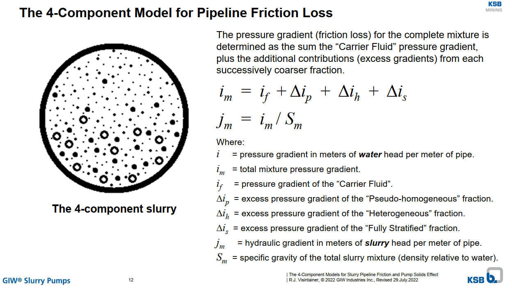
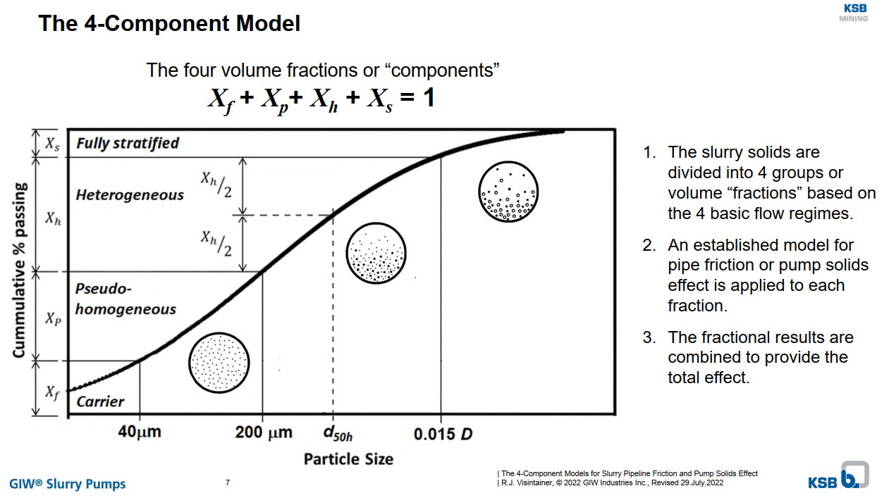

# FourCompSlurryModel

Python implementation of the [4-Component Slurry Model](https://www.ksb.com/en-us/services/service-for-slurry-pumps/hydraulic-lab).

The four slurry flow regimes are:

- Carrier Fluid
- Pseudo-homogeneous
- Heterogeneous
- Fully Stratified

The Carrier Fluid regime considers particles smaller than 40 μm. These solid particles mix with liquid in such a way that mixture viscosity is affected.

The Pseudo-homogeneous regime considers particles larger than 40 μm and smaller than 200 μm. Due to the turbulence, the solid particles are supported within the fluid. The mixture's viscosity is not affected by this regime.

The Heterogeneous regime considers particles larger than 200 μm and smaller than 1.5% of the pipe's diameter (μm). Particles of this size begin to settle creating a heterogeneous mixture where the solids are found in greater concentration at the bottom of the pipe. Turbulence in the fluid and contact with the pipe wall support these solids from settling out of the fluid.

The Fully Stratified regime considers particles larger than 1.5% of the pipe's diameter (μm). Solids are primarily supported by the pipe wall and will slide along the bottom of the pipe. A sliding bed friction model is used for this flow regime.

Reference:

- [AFT Fathom 4-Component Slurry Model](https://docs.aft.com/fathom13/4-Component-Slurry-Model.html)
- [GIW Industries Inc.](https://www.ksb.com/en-us/services/service-for-slurry-pumps/hydraulic-lab)
